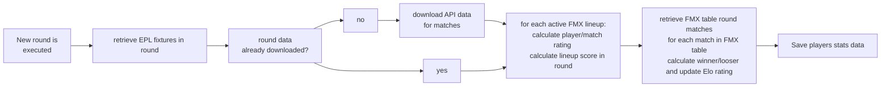

 
# Intro  

I wanted to create a project that felt “alive”, not just a website where users interact to each other, but a website that changes its internal status in time, providing a differentr experience each time a user logs in. I came up with a collective game, more specifically my own version of a fantasy football manager called **FMX**.

**What’s a fantasy football manager (FFM) and what’s FMX?**

A FFM is a type of game played by many soccer fans around the globe, and it’s usually based on real data from a specific soccer league (e.g. English Pramier League, Spanish Liga, etc..)
The main rules of an FFM are:

+ Each user creates its own team by buying soccer league players [^4] (all user are allocated a budget);
+ User teams play against each other, just like in a real soccer league;
+ Each player gets a score based on how he performed in an associated real soccer match, based on match rating, goals, assists, yellow/red cards and other parameters;
+ Each player score (for each team) is added;
+ The team with a higher score wins the match.

**FMX** implements the previous rules and add a few extra functionalities:

+ Once registered, users assemble their squad of 16 players [^4] (2 goalkeepers, 5 defenders, 5 midfielders, 4 attackers) using the allocated budget;

+ Once the squad is completed users can create their first lineup by choosing the 11 players that will step on the virtual field and also the system of play (eg: **352** - 3 defenders, 5 midfielders, 2 attackers 
  or **442** - 4 defenders, 4 midfielders, 2 attackers, etc..);

+ Once the lineup is created the team is automatically added to the **FMX League** where it will play against the other teams already in the league
+ Users can change their lineup at any moment, taking advantange of the best performing players
+ users can sell/sign players for their teams (always depending on the budget available), it's important to remember that:

  - Players value changes in time depending on their current performance vs historical performance; 
  - Team budget is increased or decreased after each round depending if a team won or lost;
  - Team budget can increase or decrease by challenging other users (or accepting challenges) to one2one matches;

# Distinctiveness and Complexity

The idea that drove me on this project was to create an app that felt "alive", where users could not just interact with each other but where the app in itself would have an internal status that would change in time based on real life data. Something that people may enjoy playing, an app to spend a few minutes every day checking stats, the latest round results, creating a new lineups or maybe considering selling a player for another etc.. I also wanted to add an UI that would make the game pleasant to play with, as a game should be.

## Complexity
### Consuming API data:
I manage to find a free API provider for English Premier League data (https://rapidapi.com/api-sports/api/API-FOOTBALL) that provides, players stats, historical player rating, fixture results, etc...
All data is based on 2021 real English Premier League data, unfortunately the API provider allows only up to 100 connections a day free of charge (limit that is easly reached by FMX) hence I decided the following approach:
+EPL Master data (EPL team and players data) is preloaded, however all the code needed to fetch and elaborate
additional API data is in the project: `views.importTeam` `views.importPlayers` `views.importFixtures`
+EPL Transactional data (fixtures results and fixture/player data) is partly preloaded and partly retrieved via API calls
 by `lineup_views.calculate_round` (detailed explanation will follow)

### Creating FMX league table:
The tournament table is created via a round robin algorithm that makes sure that all teams play against each other in a home and away round. Although the algorithm description is well known, I wrote the code in python completely from scratch (`table_views.create_table`), however (due to dynamic nature of the app) just creating the table was just part of the problem, as you can see from the following point. 

### Adding new teams to the game:
New teams joining the game was probably the biggest complexity, a problem that doesn't exist in real life (real tournament tables are fixed) and that is intrinsic in the "shared" nature of the game.
One issue was how to rank teams that joined at different moments (explained in next point) but the main complexity was how to insert new teams in the table without compromise existing teams experience. A quick example to explain:
  Teams A B C D are playing in FMX League, several rounds have already been played, the current table is:

<table>
<tr><th>Round 4 </th><th>Round 5</th><th>Round 6 (next round)</th><th>Round 7</th></tr>
<tr><td>

|Team 1| Results | Team 2|
|--|--|--|
|Team A  | 142 - 154 | Team B |
|Team C | 156 - 151| Team D |

</td><td>

|Team 1| Results | Team 2|
|--|--|--|
|Team A  | 163 - 155 | Team C |
|Team B | 143 - 1149 | Team D |
<td>

|Team 1| Results | Team 2|
|--|--|--|
|Team A  | - | Team D |
|Team B | - | Team C |

</td>
<td>

|Team 1| Results | Team 2|
|--|--|--|
|Team B  | - | Team A |
|Team D | - | Team C |

</td>
</td></tr> </table>

just before Round 6 is run, Team E joins the game (meaning it has bought all the needed players and has created an active lineup), clearly would be unacceptable to just delete and recreate a new table, and I also didn't want to change the board for the next round (assuming existing teams are looking forward to the next round). So the algorithm is:

 1. New teams (Team E in example) are matched against internal FMX team (called **FMX Home Team**) in the next round;
2. all following rounds are deleted
3. if number of teams is odd = recreate (extend) league table adding FMX Home Team to the list of Teams [^5]
. if the number of teams is even = recreate (extend) league table with only players teams

<table>
<tr><th>Round 4 </th><th>Round 5</th><th>Round 6 (next round)</th> </tr>
<tr><td>

|Team 1| Results | Team 2|
|--|--|--|
|Team A  | 142 - 154 | Team B |
|Team C | 156 - 151| Team D |

</td><td>

|Team 1| Results | Team 2|
|--|--|--|
|Team A  | 163 - 155 | Team C |
|Team B | 143 - 149 | Team D |

<td>

|Team 1| Results | Team 2|
|--|--|--|
|Team A  | - | Team D |
|Team B | - | Team C |
|**Team E** | - | **FMX Home Team** |

</td>
</td></tr> </table>
<table>
<tr> <th>Round 7</th><th>Round 8</th></tr>
<tr> 
<td>

|Team 1| Results | Team 2|
|--|--|--|
|Team A  | - | Team B |
|Team D | - | **Team E** |
|Team C | - | FMX Home Team |

</td>
<td>

|Team 1| Results | Team 2|
|--|--|--|
|**Team E** | - | Team D  |
|Team A | - | FMX Home Team |
|Team B | - | Team C |

</td>
</td></tr> </table>

This solution keeps data consistency while making sure that new teams can be added at any moment. But it also creates
a problem, how to rank teams that have played a different number of matches. `table_view.new_team_in_table`

###  Ranking teams in table:
In such a dynamic game it wouldn't make sense to rank teams by number of matches won/lost so I implemented my version of the Elo rating system (https://en.wikipedia.org/wiki/Elo_rating_system), used in chess and other games. The idea is that each player starts with a ranking (1000 points in FMX) and wins or looses points depending on the strength of the opponents. I implemented the code in python from scratch. Code in `lineup_views.calculate_results`   

###  Calculate matches results:
From a data point of view we have 2 sets of data separate but connected: EPL data (the real Premier League data) and FMX data, whenever a round is played a number of steps are taken to make sure FMX data reflect EPL real live data 

Those steps are performed by: 
+`lineup_views.check_for_round_data`: checks if EPL transactional data has been already fetched (due to previously mentioned API limitations) otherwise proceeds to fetch
+`lineup_views.calculate_round`: fetches and transform API data for round 
+`lineup_views.get_fixture_ratings`: each EPL player is rated for the round with the following formula: 
*[player round rating]+[player historical rating]+[3 points for each goals]+[1 point for each assist]-[1 point for each yellow card]-[3 points for each red card]*. 
Players that didn't actually play any match are rated: 
*6+[player historical rating].* 
Player value is also updated depending on how they performed vs historical performance
+`lineup_views.lineup_scores` for each active FMX active lineup, total score is calculated 
+`lineup_views.calculate_results` for each match in FMX table the winner/looser is calculated[^bignote] and elo rating is updated. Winner get a small amount added to its budget, looser looses a small amount

###  Running game rounds scheduler:
I built my own notification system that would inform teams when a new round had been played by the scheduled job:
+ Backend
  1. When the app is started a scheduled job is created (package `apscheduler`) [^2] `run_update.round_retriever`;
  2. The current round number is saved in model `class Starter(models.Model):`;
  3. When `round_retriever` runs, a new round is fetched and calculated and the round number is incremented;
  4. the new round number is saved in model `class Starter(models.Model):`
+ Frontend 
  1. when a user logs in a javascript function fetches the current round umber (from `class Starter(models.Model):`)
  2. every few seconds the fetch is repeated, if a change in round number is detected, a popup box informs the player that a new round has just been played, by clicking on "My Stats" or "Results" or "Table" user will be able to view all the round details and stats. 

## Distinctiveness
In order to enhance user experience I've added a several extra features:
In order to do that I added a few features:
### one2ones
Playing in the FMX League is not the only way to play against other players, users can challenge other players for a bet amount, once the challenge is sent it will be in status **pending** until the other user either **accepts** or **refuses** the challenge. 
If the challenge is accepted it will be immediately run against a **random** EPL round (the actual real live data), and the bet amount will be tranfered from the looser to the winner budget. FMX Table, elo rating, etc... are not impacted.
### My Stats
As any sports game, match results and table standings are just part of the game, stats are always very appreciated by game players.
I added a "My Stats" page where users can review which are the FMX overall best players and best goalscorers and where user could review team & players performance but also how the team is doing "financially" [^3]
### Random headlines 
Each time a player is bought/sold or a one2one challenge is accepted, a mockup newspaper frontpage is shown with an ai
generated newspaper title. the mockup titles have been fetched from "OPEN AI" API (https://open-ai25.p.rapidapi.com/ask).
Due to the limitations in allowed request, the data has been fetched and saved into FMX model, however the code to fetch the headlines is still present in `market_views.get_headlines`
### Admin tools
The game administrator is a player like all the other ones, he/she can buy/sell players, create lineups, challenge other players etc..
But on top of that it has a set of admin tools at his/hers disposal:
+ **Run round**: Instead of waiting for the scheduled job to run, the admin can activate the run round procedure at a click of a button
+ **Reset FMX**: Clicking the button will reset all FMX data and basically restart a new league: all teams/players scores and values are reset, and a new table (with all active lineups) is created.
+ **set round interval**: admin can set how often the scheduling job runs. In a live production game that would probably be every 24 hours, but since it would be impractical, the value can be set to just a few minutes. This feature require server restart.

<table>
<tr><th>Little Island</th><th>Hackney Boys</th> </tr>
<tr><td>

|Player|Role|  EPL Team | career rating |
|--|--|--|--|
|Allison|Goalkeeper| Liverpool|7.1|
|B. Davies|Defender| Tottenham|6.9|
|J. Grealish|Midfielder| Man City|7.1|
|H. Kane|Attacker| Tottenham|7.4|

</td><td>

|Player|Role|   EPL Team | career rating |
|--|--|--|--|
|Ramsdale|Goalkeeper|Arsenal|6.9|
|J. Matip|Defender| Liverpool|7.3|
|K. Havertz|Midfielder| Chelsea|6.8|
|Cristiano Ronaldo|Attacker| Man Utd|7.2|

</td>
 </tr> </table>
EPL round 20 season 2021/2022
<table>
<tr><th>Little Island</th><th>Hackney Boys</th> </tr>
<tr><td>

|Player|Role| EPL Team | career rating | round rating|bonus|score
|--|--|--|--|--|--|--| 
|Allison|Goalkeeper| Liverpool|7.1| 6.2|-1 (goal conceded)|12.3|
|B. Davies|Defender| Tottenham|6.9| 7.0|0|13.9|
|J. Grealish|Midfielder| Man City|7.1| 6.6|0|13.7|
|H. Kane|Attacker| Tottenham|7.4| 7.0|+3 (goal scored)|17.4|
||||||total|57.4|
</td><td>

|Player|Role|   EPL Team | career rating | round rating|bonus|score
|--|--|--|--|--|--|--| 
|Ramsdale|Goalkeeper|Arsenal|6.9| 6.2|-1 (goal conceded)|11.9|
|J. Matip|Defender| Liverpool|7.3| 7.5|-1 (yellow card)|13.8|
|K. Havertz|Midfielder| Chelsea|6.8| 6.0|(not on field)|12.8|
|Cristiano Ronaldo|Attacker| Man Utd|7.2| 7.3|+4 (1 goal scored, 1 assist)|18.5|
||||||total|57|
 
</td>
 </tr> </table>

[^bignote]: in case of draw, the home team is declared a winner

[^2]:The scheduled job interval can be set from the FMX admin account (2 minutes, 5 minutes, 1 hour, 24 hours, etc..)

[^3]:Teams can still play both League and one2one with a negative budget. However players can't be bought if funds are not available.

[^4]:Players are not exclusive to a team, differently from real life a player can be a member of multiple separate teams.

[^5]:Until the number of teams is odd, FMX Home Team is part of the table, however it's not shown on the overall table.