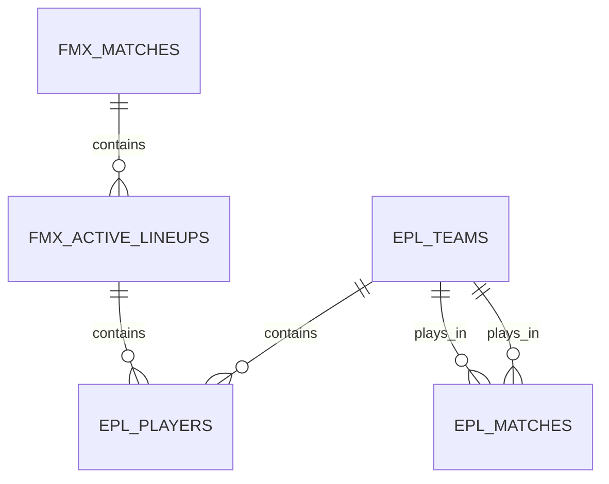
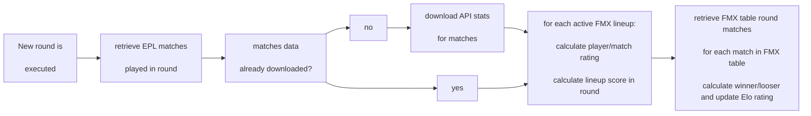

# Intro

I wanted to create a project that feels “alive”, not just a website that allows users to interact to each other, but a website that changes its internal status in time.

I came up with a collective game, more specifically my own version of a fantasy football manager called **FMX**.

 

**What’s a fantasy football manager (FFM) and what’s FMX?**

 

A FFM is a type of game played by many soccer fans around the globe, and it’s usually based on real data from a specific soccer league (e.g. English Pramier League, Spanish Liga, etc..)

The main rules of an FFM are:

+ At the start of the season, each user creates its own team by buying soccer league available players.

+ User teams play against each other, just like in a real soccer league

+ Once the squad is created each users creates a lineup out of its team players (the 11 players that will step on the virtual soccer pitch)

+ Each player gets a score based on how he performed in an associated real soccer match, based on match rating, goals, assists, yellow/red cards and other parameters.

+ Each player score (for each lineup is added)

+ The lineup with a higher score wins the match.

 

**FMX** follows the previous rules and add a few extra functionalities:

+ Once registered users are required to assemble their own squad of 16 players (2 goalkeepers, 5 defenders, 5 midfielders, 4 attackers) using the available budget

+ Once the squad is completed users are required to create their first lineup by choosing not just the 11 players but also the system of play like 352 (3 defenders, 5 midfielders, 2 attackers)

  or 442 (4 defenders, 4 midfielders, 2 attackers)

+ Once the lineup is created the user team is automatically added to the FMX League Table where it will play against the other teams already in the league

+ Users can change their lineup at any moment, taking advantange of the best performing players

+ users can sell/sign players for their teams (always depending on the budget available), but it's important to consider that:

  - Players value changes in time depending on their performance vs performance expectations (a player bought for 10 at the start of the game may be worth 10+x or 10-x at time of sell)

  - Team budget is slightly increased or decreased after each table round depending if a team won or lost

  - Team budget can increase or decrease by challenging other users (or accepting challenges) to one2one matches

 

# Distinctiveness and Complexity

As previously mentioned I wanted to create an app that felt "alive", where users could not just interact with each other but where the app in itself would have an internal status that would

change in time. I also wanted it to consume real life data from external APIs (something that was missing from previous projects). On top of that I wanted to add an UI that would make the game

pleasant to play with.

## Complexity

### Consuming API data:

I manage to find a free API provider for English Premier League data (https://rapidapi.com/api-sports/api/API-FOOTBALL) that provides, players stats, historical player rating, fixture results, etc...

All data is based on 2021 real English Premier League data, unfortunately the API provider allows only up to 100 connections a day free of charge (limit that is easly reached by FMX) hence some data is actually saved locally.

 

### Creating the league table:

the table is created via a round robin algorithm that makes sure that all teams play against each other in a home and away round. Although the algorithm

  description is well known, I wrote the code in python completely from scratch, however (due to dynamic nature of the app) just creating the table was just part of the problem, as you can see from the following point.

### Adding new players to the game:

New players joining the game was probably the biggest complexity, one issue was how to rank teams that joined at different moments (see next point)

  but the main complexity was how to insert new teams in the table without compromise existing team experience. A quick example to explain:

  Teams A B C D are playing in FMX League, several rounds have already been played, the current table is:

<table>

<tr><th>Round 4 </th><th>Round 5</th><th>Round 6 (next round)</th></tr>

<tr><td>

 

|Team 1| Results | Team 2|

|--|--|--|

|Team A  | 142 - 154 | Team B |

|Team C | 156 - 151| Team D |

</td><td>

 

|Team 1| Results | Team 2|

|--|--|--|

|Team A  | 163 - 155 | Team C |

|Team B | 143 - 1149 | Team D |

 

<td>

 

|Team 1| Results | Team 2|

|--|--|--|

|Team A  | - | Team D |

|Team B | - | Team C |

 

</td>

 

</td></tr> </table>

just before Round 6 is run, Team E joins the game (meaning it has bought all the needed players and has created an active lineup), clearly would be unacceptable to just delete and recreate a new table,

but I also didn't want to change the board for the next round (assuming existing players are already looking forward to the next round). So the algorithm is:

 1. When a new team is added (Team E) match it in the next round against internal FMX team (called FMX Home Team), note: FMX Home Team won't show in the overall ranking.

2. delete all following rounds

3. if number of teams is odd = recreate (extend) league table adding FMX Home Team to the list of Teams

. if the number of teams is even = recreate (extend) league table with only players teams

<table>

<tr><th>Round 4 </th><th>Round 5</th><th>Round 6 (next round)</th> </tr>

<tr><td>

 

|Team 1| Results | Team 2|

|--|--|--|

|Team A  | 142 - 154 | Team B |

|Team C | 156 - 151| Team D |

</td><td>

 

|Team 1| Results | Team 2|

|--|--|--|

|Team A  | 163 - 155 | Team C |

|Team B | 143 - 1149 | Team D |

 

<td>

 

|Team 1| Results | Team 2|

|--|--|--|

|Team A  | - | Team D |

|Team B | - | Team C |

|Team E | - | FMX Home Team |

</td>

 

</td></tr> </table>

 

 

 

<table>

<tr> <th>Round 7</th><th>Round 8</th></tr>

<tr> 

<td>

 

|Team 1| Results | Team 2|

|--|--|--|

|Team A  | - | Team B |

|Team D | - | Team E |

|Team C | - | FMX Home Team |

</td>

<td>

 

|Team 1| Results | Team 2|

|--|--|--|

|Team D  | - | Team E |

|Team A | - | FMX Home Team |

|Team B | - | Team C |

</td>

</td></tr> </table>

in this way we can keep data consistency while making sure that new teams can be constantly added, but it also creates

a problem, how to rank teams that have played a different number of matches

 

 

###  Ranking teams in table:

in such a dynamic game it wouldn't make sense to rank teams by number of matches won/lost so I implemented my version of the Elo rating system (https://en.wikipedia.org/wiki/Elo_rating_system),

  used in chess and other games. The idea is that each player starts with a ranking (1000 points in FMX) and wins or looses points depending on the strength of the opponents

  again, I implemented the code in python from scratch.    

###  Calculate matches results:

from a data point of view we have 2 sets of data separate but connected: EPL data (the real Premier League data) and FMX data

### Rating players:

###  Running game rounds periodically: